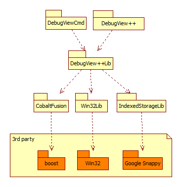

Project dependencies
--------------------

1. Project **DebugViewCmd**
CommandLine version of debugview++, 
enables piping debugview output into another process.

2. Project **DebugView**
Main project, contains all WTL/ UI  specific code

3. Project **DebugView++Lib**
All infrastructure a 'debugview'-like application needs,
but nothing UI-related,for example: filters, FileIO, PipeReader, LogSources

4. Project **CobaltFusion**
Anything that is reusable beyond DebugView and has no dependencies other then C++11
(and boost while we are using vs2010)

5. Project **Win32Lib**
This project should contain only low-level helpers and convenience methods on top of the win32 library.
It now also contains left-overs, of which some might be better moved into DebugView++/Win32Support.cpp

6. Project **IndexedStorageLib**
Contains VectorStorage and SnappyStorage, two
indexed-string-storage classes

Current state of implementation:
--------------------------------

- class LogSources is now a container and not using the circular buffer yet
- m_autoNewline should be a per-logsource setting

- LogSource::Notify() is called from LogSources::Run 
when WaitForMultipleObjects returns and indicated that the corresponding HANDLE is signaled.

- LogSource::Notify() then adds a Line to the circular buffer,
or in case of autonewLine = false, into a fixed 8kb buffer of the LogSource

