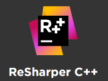
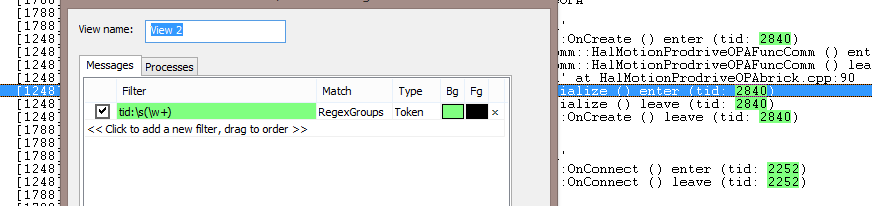
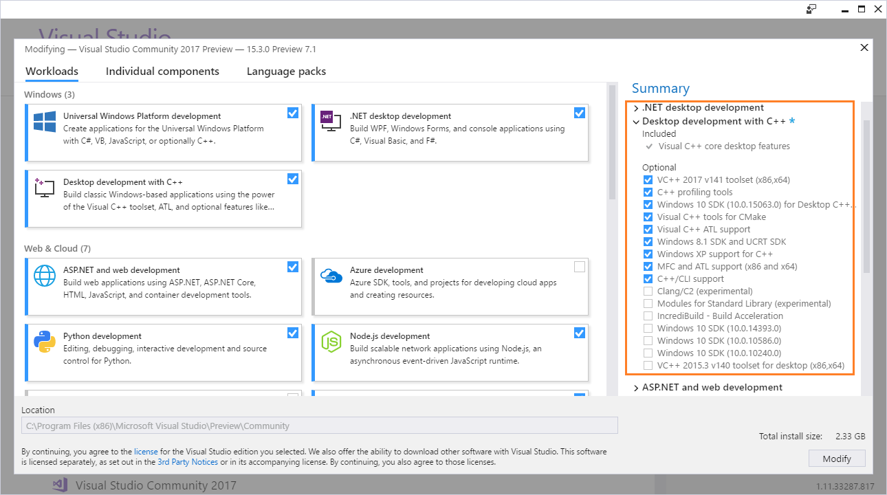

Cobalt Fusion presents:

Debugview++, currently at v1.8
------------------------------

[](https://ci.appveyor.com/project/janwilmans/debugview/branch/master)

[Download latest release](https://github.com/djeedjay/DebugViewPP/releases), I would really like to hear what you think! Leave any [**comments here**](https://github.com/djeedjay/DebugViewPP/issues/283)

[Download head version ](https://ci.appveyor.com/project/janwilmans/debugview/build/artifacts) ** only pick this if your feeling lucky and want to try the latest commits **

Questions? Tweet me at [**@janwilmans**](https://twitter.com/janwilmans) or chat on skype at 'janwilmans'.
There is also a [slack channel](https://cpplang.slack.com/messages/debugviewpp)

Debugview++ started as a viewer for Win32 OutputDebugString messages in the style of
Sysinternals DebugView. However, it can now be attached to virtually any other kind of logging, such as:
- tailing ascii and UTF logfiles (just drag it onto the window)
- Android ADB (or any console based standard output)
- serial ports (using plink)
- sockets, telnet or ssh ports (also using plink)
- it can listen for UDP messages, handy in distributed systems

See examples down below.

Sponsors
--------

This project is sponsored by:

[](https://www.jetbrains.com/)

Build in code analysis, handy auto-fixes and refactoring options

[](https://backtrace.io/ )

Gather and analyse crash information.

[](https://www.incredibuild.com/)

We use Incredibuild to make use of all cores of multiple machines to accelerate building our C++ projects.

So when is this Debugview++ thing useful?
------------------------------------------

- first of all, with debugview++ you can see messages from different processes, not just 'attached' processes.
- also: filtering, coloring and linking. To make sense of a large amount of information humans need to filter it or order it understand it. Also it helps if important events have different colors to quickly interpret the occurring patterns.
- finally, filtering is nice, but sometimes you need to see a line in its context to understand it, this is where linked views can help to quickly switch between a fully filtered view and a fully detailed view. 

New in stable version 1.8.x:
- bugfixes (namely in file-tailing)
- tested on windows 10
- last version with (official) XP support (v141_xp target)
- internal refactoring from boost to C++11/14 constructs
- better commandline support using docopt.cpp
- added filtering command line options
- no other new features planned, if you're missing something you need, file an issue!

Features we dream about and will create when we choose to spend the time:
- a gantt chart-like view, a horzontal timeline, with bars/flags/signs on it to identify events
- a better plugin based input system
- transparent background streaming to disk
- proper memory limits

Known issues:
- the history limit doesn't work right, this is troublesome for long-running duration-tests.
  A workaround is to send 'DBGVIEWCLEAR' before each test-cycle (this clears all logs from memory).
- there is no 'pass-through' mode like the original dbgview had, if you can help me implement this, please contact me.
- same goes for catching kernel messages, help wanted.

References
----------
[OutputDebugString on MSDN](https://msdn.microsoft.com/en-us/library/windows/desktop/aa363362(v=vs.85).aspx)

Screenshot
-----------


Here are some features:

- single selfcontaining executable, setup is provided but not required
- minimal delay of the traced application, compared to the original dbgview a factor of 10 better.
- fast and responsive user-interface, even with +50.000 incoming lines per second
- runs without prerequisites on WinXPSP3 and up (v1.5 and earlier also on WinXPSP2)
- in-memory compressed logbuffer using google snappy (typically -50% RAM consumption)
- tailing files (drag ascii or UTF files into debugview to tail it)

And more features:
 
- capture both Win32 and Global Win32 messages
- tabbed views
- resolve process PID to name and track their lifetime
- filter by process or message
- advanced filtering, exclude, track, stop, clear (optionally using regular expressions) 
- line and token highlighting (create your own syntax highlighting)
- SAIT (search-as-I-type) + token highlighting
- bookmarks
- statusbar shows detailed log/view/selection information
- open saved logs for post-mortum analysis
- commandline version
- capture stdin piped messages, allows you to connect any kind of logging
- beep-filter for monitoring without seeing the screen (To hear it make sure a 'Default Beep' sound is defined in Control Panel->Sounds)
- clear Log now releases the message buffer instead of reusing the memory (useful when running debugview 
  for a very long time)
- tailing logfiles over samba network (experimental)
- support for reading and tailing Sysinternals Dbgview logfiles (in the four most common formats)
- socket listening, Log->Sources->Add can add TCP and UDP listeners, the protocol is sending raw newline terminated strings. Multiple lines can be send in one packet.
- dbgview agent client mode allowing logging of kernel messages
- timezone independent and human readable timestamps in the logfiles
- add basic support for unicode, UTF-8 via OutputDebugString and both UTF8 and UTF16 with BOMs when reading files
- View->Process Colors, easy way to give every process its own color!
- Options->Link views, best effort to synchronize the line-selection over all views

Download old version (stable, dated 20 Sept 2015)
-----------------------
+ [DebugView v1.5.x Zipped executables](https://github.com/CobaltFusion/DebugViewPP/files/1408599/DebugView.v1.5.zip)
+ [DebugView v1.5.x Win32 installer](https://github.com/CobaltFusion/DebugViewPP/files/1408607/DebugView.v1.5_msi.zip)

Screenshot demonstrating bookmarks and highlighting features.

**Highlighted**:

- regex (token filter):     ``[^\s]*\\[\\\w+\.\s]+``    filenames in blue
- regex (token filter):     ``0x\w+``                   hexadecimal numbers in red
- regex (highlight filter): ``Unittest``                lines with the word 'Unittest' have a lightgreen background
- a doubleclick on 'bytes' causes all instances of 'bytes' to highlight in yellow

See http://www.cplusplus.com/reference/regex/ECMAScript/ for all options for supported regular expressions

**Android ADB example**:


Screenshot demonstrating connecting to ADB logcat (Android Debug Bridge)

More examples
-------------

**Connect any pipe**:

To connect directly to a port or service, [plink] can be used, make sure an instance of debugview++ is already running before running this command:

> plink -ssh -batch -v 192.168.0.1 2>&1 | debugview++

Notice that 2>&1 is used *before* the pipe (|) symbol to redirect stderr to stdout.

[plink]: http://www.chiark.greenend.org.uk/~sgtatham/putty/download.html

**Connect to sysinternals dbgview agent for kernel messages**:

Example: connect to sysinternals DbgView Agent, first start Dbgview.exe /a /k (/k for kernel messages)
And connect DebugView++ using Log->Connect DebugView Agent. Note that 'Log->Connect DebugView Agent' assumes the agent is running on the same workstation as DebugView++ so it connects to 127.0.0.1. If you need to connect to a remote agent, use Log->Sources...->Add->DbgView Agent and fill in the ip-address.

**Use RegexGroups + Token Highlighting**:

Suppose you want to highlight some data value in your logging, since the actually value may differ, you cannot use normal matching to highlight them. With RegexGroups you can match text _before_ or _after the actual token you want to highlight.

Example:



Filters:
--------


Filters can be defined per view, for example choose File -> New View, and the filter dialog will popup.
Pressing OK will open a new view without any filters. 

Different types of filters:

All filters support regular expressions, if you are not familliar with regular expressions you can
just type any word or part of a word to match.

- include: if an include filter is added only lines containing a matching expression will be included.
- exclude: lines containing a matching expression will be excluded from the view, excluding always takes precedence over including
- once: only the first line containing a matching expression will be included, this resets automatically at 'clear view'. 
- highlight: lines containing a matching expression will be highlighted using the specified foreground and background colors
- token: only the matching expression will be highlighted using the specified foreground and background colors
- track: lines containing a matching expression will be focused and centered if possible. Note: auto scroll turns off if a track filter is matched 
- stop: if a matching expression is found autoscroll is turned off, all track filters will be disabled and the line is focused. Note: stop filters work only if autoscroll is on, think of a stop-filter as a single-shot track filter
- beep: a standard windows beep (configurable in config panel->sounds) is played 

*Practical uses*:

Include, exclude, once and highlight filters are the most intuitive filters to use. Track and stop can be a little confusing, let me try to give some examples.

**track**: use this filter to focus interesting lines that do not occur very often, but at a regular interval, for example, so you are monitoring a process that logs output every 30 seconds and you need to check the result. 

**stop**: this filter is good when some special event occurs (an exception?) and you want to inspect the context of the event in the log before continuing. A press of the 'end' button will resume auto scrolling.

Other features:
----------------

**views**:
- reset view; make the first line in the logbuffer the first line in the view
- reset view to this line; make the current like the first line in the view
- clear view; make next incoming message the first line in the view

**link views**: the selected line in the current view is located re-selected when you switch to another view. This is done on a best-effort bases, so if the exact line is not found, the nearest line is selected. In that case switching views will cause the currently selected line to change.

Consider this use case:

If you want to have auto scoll on, but some high frequeny messages are annoying you, but you cannot exclude them because they help you diagnose your event when it occurs, try this:

Use two views, one where the diagnostic messages are filtered and autoscroll is on, and one where the messages are included (and maybe highlighted), next turn on the 'link views' feature.

Now you can monitor the filtered view, and when your event occurs, select a line and switch to the unfiltered view, the same line is now highlighted, but in full unfiltered context.

**process colors**: If enabled each process (even processed with identical names) will get a its own background color automatically without adding any filters.

Other documentation:
--------------------

**Auto Scroll**: scrolls down to new incoming lines automatically

**Auto Scroll Stop**: If enabled 'auto scroll' is turned on when the last line in the view is selected, and also
turned off if any other line is selected.

**Bookmarks**: bookmarks are view specific and can be placed on a line by clicking left of the line number or Ctrl+F2, press F2 to move to the next bookmark. Bookmarks are temporary, so cannot be saved.

**ClockTime**: when enabled the time is displayed as provided by the system's real-time clock (RTC). Such a timestamp has a 16ms resolution on a typical desktop PC. When disabled, time is displayed as a relative time to the first message, however this timestamp is obtained from the High-Performance Counter (HPC) which typically has a sub-microsecond resolution.

The resolution should not be confused with accuracy here, the recorded timestamp is not the actual time the message occured, it is the time the message was received by DebugView++. Also there is no quarantee that the time between occurance and reception of messages is constant, *however* in practice this is **pretty** constant :)

How to build
------------
This project has a special configuration:
- 32bit debug/release configurations are targeted to v140_XP, SDK v7.0 (windows XP SP3 and up)
- 64bit debug/release configurations are targeted to v141, SDK v8.1 (runs on windows 7 and up)
- only the release configurations also build the Wix installer

The projects are configured to use Nuget to get there dependencies (boost and WTL)
However, to build the installer you have to install [Wix Toolset manually](http://wixtoolset.org/)

## cloning the GIT repository:

```
git clone --recurse-submodules https://github.com/CobaltFusion/DebugViewPP.git
```

(don't forget to include --recurse-submodules, otherwise you will get an error message saying docopt.h is missing.)
You press 'build' and visual studio will download boost and WTL the first time only and then build the project. It is as simple as that... if it is not, contact me (jan), so I can fix any remaining issues.

Since we use ATL and support Windows XP still some extra installation options are required, verify that the following option are installed:



- zip.exe, http://gnuwin32.sourceforge.net/packages/zip.htm, choose [zip-3.0-setup.exe]
 decompress the archive and you're done (add zip.exe to the path)

-= Cobalt Fusion =-

Jan Wilmans
mailto:janwilmans _at_ gmail.com

Gert-Jan de Vos
mailto:boosttestui@on.nl

