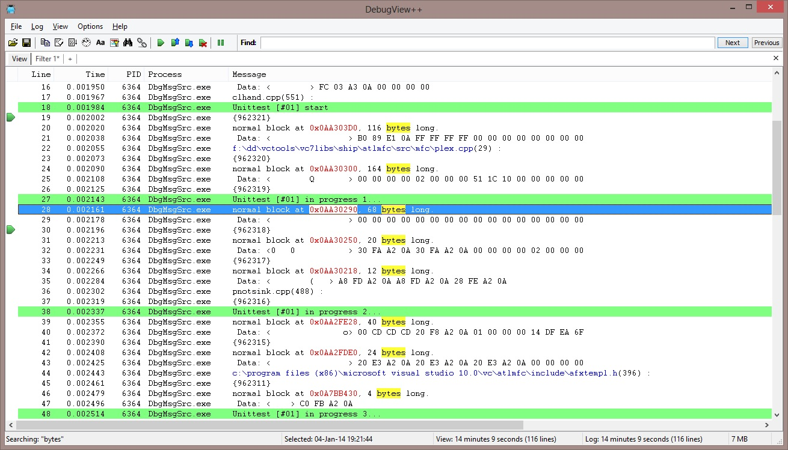
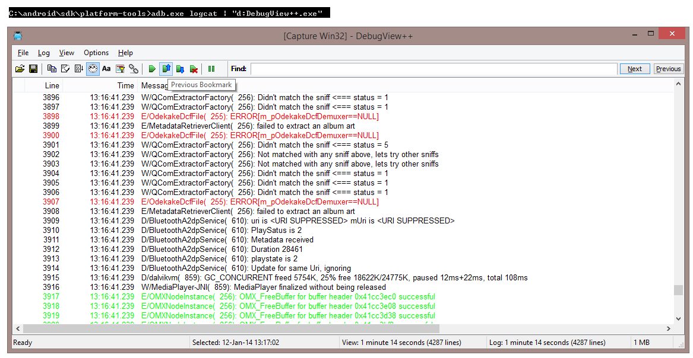

Cobalt Fusion presents:

DebugView++
----------

DebugView++ is primarily a viewer for Win32 OutputDebugString based logging in the style of
Sysinternals DebugView. But can also be attached to virtually any other kind of logging.

These are some of its features:

- single selfcontaining executable, setup is provided but not required
- runs without prerequisites on WinXPSP3, Vista and 7/8.x
- capture both Win32 and Global Win32 messages
- tabbed views
- resolve PID to process name
- filter by process or message
- advanced filtering, exclude, track, stop, clear (optionally using regular expressions) 
- line and token highlighting (create your own syntax highlighting)
- minimal delay of the traced application, compared to debugview a factor of 10 better.
- fast and responsive user-interface, even with +50.000 incoming lines per second
- SAIT (search-as-I-type) + token highlighting
- bookmarks
- statusbar shows detailed log/view/selection information
- open saved logs for post-mortum analysis
- memory compressed logbuffer using google snappy (-50% RAM consumed)

New features in v1.2
- Commandline version
- tailing files (drag an ascii file into debugview to tail it)
- capture stdin piped messages, allows you to connect any kind of logging

Coming up (implemented in bleeding-egde version)

- Redesign of the monitoring code, more flexible and efficient, enable use of any
  collection as linebuffer
- fixed issue #140: Highlight filters take precidence over other filters for coloring of the entire line
- add beep-filter for monitoring without seeing the screen (To hear it make sure a 'Default Beep' sound is defined in Control Panel->Sounds)
- fixed un-pause problem
- Clear Log now releases the message buffer instead of reusing the memory (might be useful when running debugview 
  for a very long time)
- continuous logging to file commandline option
- tailing our own logfiles over samba network
- support for reading and tailing Sysinternals Debugview logfiles (four common formats)
- implemented tailing overwritten/skrinking logfiles

Download Stable release
-----------------------

+ [DebugView v1.2 Zipped executables](http://www.myquest.nl/sites/debugview/Release_v1.2/DebugView++.zip)
+ [DebugView v1.2 Win32 installer](http://www.myquest.nl/sites/debugview/Release_v1.2/DebugView++.msi)

Download Bleeding Edge !! Updated on July 15 2014 (fixed kernel messages)
----------------------

+ [DebugView v1.3.x Zipped executables](http://www.myquest.nl/sites/debugview/BleedingEdge/DebugView++15_july.zip)
+ [DebugView v1.3.x Win32 installer](http://www.myquest.nl/sites/debugview/BleedingEdge/DebugView++15_july.msi)

Documentation
--------
at http://debugviewpp.wordpress.com/

Screenshots
-----------

Screenshot demonstrating bookmarks and highlighting features.

Screenshot demonstrating connecting to ADB logcat (Android Debug Bridge)

More examples
-------------

To connect directly to a port or service, [plink] can be used:

> plink -ssh -batch -v 192.168.0.1 2>&1 | debugview++

Notice that 2>&1 is used *before* the pipe (|) symbol to redirect stderr to stdout.

[plink]: http://www.chiark.greenend.org.uk/~sgtatham/putty/download.html

Highlighted:
------------
- regex (token filter):     ``[^\s]*\\[\\\w+\.\s]+``    filenames in blue
- regex (token filter):     ``0x\w+``                   hexadecimal numbers in red
- regex (highlight filter): ``Unittest``                lines with the word 'Unittest' have a lightgreen background
- a doubleclick on 'bytes' causes all instances of 'bytes' to highlight in yellow

See http://www.cplusplus.com/reference/regex/ECMAScript/ for all options for supported regular expressions

Filters:
--------

Filters can be defined per view, for example choose File -> New View, and the filter dialog will popup.
Pressing OK will open a new view without any filters. 

Different types of filters:

All filters support regular expressions, if you are not familliar with regular expressions you can
just type any word or part of a word to match.

- include: if an include filter is added only lines containing a matching expression will be included.
- exclude: lines containing a matching expression will be excluded from the view, excluded always takes precedence over include.
- once: only the first line containing a matching expression will be included, this resets automatically at 'clear view'. 
- highlight: lines containing a matching expression will be highlighted using the specified foreground and background colors
- token: only the matching expression will be highlighted using the specified foreground and background colors
- track: lines containing a matching expression will be focused and centered if possible. Note: auto scroll turns off if a track filter is matched 
- stop: if a matching expression is found autoscroll is turned off, all track filters will be disabled and the line is focused. Note: stop filters work only of autoscroll is on, think of a stop-filter as a one-shot track filter
- beep: a standard windows beep (configurable in config panel->sounds) is played 

*Practical uses*:

Include, exclude, once and highlight filters are the most intuitive filters to use. Track and stop can be a little confusing, let me try to give some examples.

**track**; use this filter to focus interesting lines that do not occur very often, but at a regular interval, for example, so you are monitoring a process that logs output every 30 seconds and you need to check the result. 

**stop**; this filter is good when some special event occurs (an exception?) and you want to inspect the context of the event in the log before continuing. A press of the 'end' button will resume auto scrolling.

Finally, consider this use case:

If you want to have auto scoll on, but some high frequeny messages are annoying you, but you cannot exclude them because they help you diagnose your event when it occurs, try this:

Use two views, one where the diagnostic messages are filtered and autoscroll is on, and one where the messages are included (and maybe highlighted), next turn on the 'link views' feature.

Now you can monitor the filtered view, and when your event occurs, select a line and switch to the unfiltered view, the same line is now highlighted, but in full unfiltered context.

Other documentation:
--------------------

**Auto Scroll**: scrolls down to new incoming lines automatically

**Auto Scroll Stop**: If enabled 'auto scroll' is turned on when the last line in the view is selected, and also
turned off if any other line is selected.

**Bookmarks**: bookmarks are view specific and can be placed on a line by clicking left of the line number or Ctrl+F2, press F2 to move to the next bookmark. Bookmarks are temporary, so cannot be saved.

**ClockTime**: when enabled the time is displayed as provided by the system's real-time clock (RTC). Such a timestamp has a 16ms resolution. When disabled, time is displayed as a relative time to the first message, however this timestamp is obtained from the High-Performance Counter (HPC) which typically has a sub-microsecond resolution.

The resolution should not be confused with accuracy here, the recorded timestamp is not the actual time the message occured, it is the time the message was received by DebugView++. Also there is no quarantee that the time between occurance and reception of messages is constant, *however* in practice this is **pretty** constant :)

How to build
------------

This is a Visual Studio 2010 project with the following dependencies (download and install separately)
- boost 1.43 or later, tested with: http://sourceforge.net/projects/boost/files/boost/1.55.0/, choose boost_1_55_0.zip
- WTL 8.0 or later, tested with: http://sourceforge.net/projects/wtl/, choose WTL80_sf.exe
- zip.exe, http://gnuwin32.sourceforge.net/packages/zip.htm, choose [zip-3.0-setup.exe]

The libraries must be installed in /Libraries and zip.exe installed, add the binary directory to your path.

Build dependencies
------------------
- WiX Toolset: install the latest binary from http://wixtoolset.org/
- boost: read the install.sh in the boost archive
- WTL and zip: decompress the archives and you're done

[zip-3.0-setup.exe]: http://downloads.sourceforge.net/gnuwin32/zip-3.0-setup.exe

-= Cobalt Fusion =-

Gert-Jan de Vos
mailto:boosttestui@on.nl

Jan Wilmans
mailto:janwilmans _at_ gmail.com
